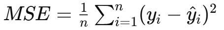
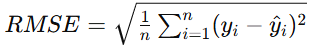
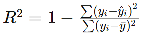
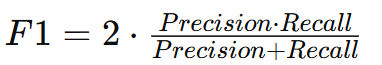

FILES:
model.onnx
scaler.pkl
app.py
requirements.txt

TEST:
    POST http://127.0.0.1:5000/telemetry
    JSON:
        {
            "cpu_usage": 72,
            "temperature": 81,
            "power": 48,
            "frequency": 4100,
          "fan_rpm": 3200
        }
    can run: python teleSpam.py 

    GET http://127.0.0.1:5000/history

    GET http://127.0.0.1:5000/summary

Running Order:
    python synthetic_generator.py
    python train_model.py
    python evaluate_model.py
    python test_scenarios.py

result:

    MAE
    MSE
    RMSE
    R²
    Residual Mean
    Residual Std
    Health Index
    RUL
    Precision
    Recall
    F1-score
    Confusion Matrix
    Classification Report

    regression-based
    sequence prediction
    residual analysis
    predictive maintenance

    val_loss: 0.0011 - val_mae: 0.0271
    
    Threshold: 1.0870837448214412
    Residual Mean: 0.23792002633251644
    Residual Std: 0.2830545728296416

MAE — Mean Absolute Error
    Measures average prediction error.

Interpretation:
    average RPM prediction deviation
Good because:
    interpretable
    robust

MSE — Mean Squared Error
    Penalizes larger errors more heavily.

Useful for:
    optimization objective
    detecting large degradation spikes

RMSE — Root Mean Squared Error
    Most common regression metric.

Interpretation:
    average prediction deviation in original RPM units

R² Score (Coefficient of Determination)
    Measures how well predictions explain variance.

Interpretation:
    closer to 1 → better modeling

Residual Mean
    Average degradation deviation.
Residual Standard Deviation:
    Measures instability/noise growth.
Higher std:
    unstable cooling
    erratic fan behavio

Health Index Trend
    Tracks degradation progression.

Maintenance Horizon / RUL
    Core predictive maintenance metric.

F1 SCORE
Balances:
    precision
    recall

Primary evaluation:
    MAE
    RMSE
    R²
    residual growth
    HI trend
    RUL behavior

PHM (health monitoring) metrics:
    Residual Mean
    Residual Std
    Health Index
    Estimated RUL

Classification Metrics:
    Confusion Matrix
    Precision
    Recall
    F1-score